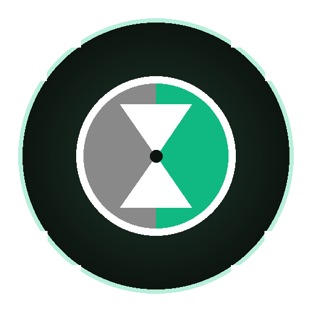

# 🧘 Enigma Focus (Android)

<p align="center">
  
</p>

<p align="center">
  <strong>Mindful App Blocker, Automated Focus Schedules & System-Wide Grayscale for Android</strong><br>
  <em>Bloqueador de aplicaciones consciente, horarios de concentración automáticos y escala de grises para Android</em>
</p>

<p align="center">
  
  
  
  
  
</p>

---

## 🌐 Languages / Idiomas
- [English Documentation](#-english-overview)
- [Documentación en Español](#-descripción-en-español)
- [📚 Technical Docs / Documentación Técnica](docs/)

---

# 🇬🇧 English Overview

**Enigma Focus** is an advanced digital wellness and productivity tool designed for Android. It combines **system-wide hardware Daltonizer grayscale mode**, **mindful breathing interruptions**, and **automated scheduled intervals** (such as 9-hour workdays and overnight sleep reminders) to break digital addiction and restore focus.

### ✨ Key Features
1. **🎨 Hardware Daltonizer Grayscale Mode**:
   - Toggles true system-wide monochrome mode directly through Android's `Settings.Secure` display daltonizer (no screen overlay filters; pure GPU monochrome).
   - Instant 1-tap manual switch, automated activation during focus sessions, and Quick Settings tile integration.
2. **🛑 Instant Mindful App Blocker (`TYPE_ACCESSIBILITY_OVERLAY`)**:
   - Zero-delay interception of distracting apps (Instagram, Reddit, TikTok, X/Twitter, YouTube, Facebook, Twitch, etc.).
   - Displays a calming **10-second Mindful Breathing Circle** (*Inhale, Hold, Exhale*) before granting temporary access.
   - Immune to Xiaomi/MIUI/HyperOS background activity launch restrictions.
3. **📅 Smart Scheduled Intervals (Multiple Shifts per Day)**:
   - **Workday Shift**: `07:30 - 16:30` (Monday to Friday) by default.
   - **Sleep / Bedtime Schedule**: `22:30 - 06:30` (Every day) with automated nighttime floating moon reminders.
   - Support for custom recurring intervals with days-of-week selection.
4. **🌙 Bedtime Reminders & Night Nudges**:
   - Gentle floating sleep popup when phone is used during sleep hours (10:30 PM - 6:30 AM).
   - 1-tap "Turn off screen & Sleep" action + 10-minute snooze option.
5. **🛡️ 24/7 Resilient Background Persistence**:
   - Multi-process architecture and battery optimization whitelist.
   - Starts automatically on device reboot (`BootReceiver`).
   - Strict Mode toggle to prevent bypasses.

---

# 🇪🇸 Descripción en Español

**Enigma Focus** es una aplicación avanzada de bienestar digital y productividad para Android. Combina la **escala de grises nativa por hardware del sistema**, **interrupciones conscientes de respiración** y **horarios programados automáticos** (jornada laboral de 9 horas y descanso nocturno) para eliminar las distracciones y potenciar tu concentración.

### ✨ Características Principales
1. **🎨 Modo Escala de Grises Nativo del Sistema**:
   - Convierte toda la pantalla del teléfono a blanco y negro real mediante los ajustes seguros de Android (`Daltonizer`).
   - Interruptor manual instantáneo de 1 toque, activación automática en sesiones de concentración y mosaico en la barra de notificaciones.
2. **🛑 Bloqueador Consciente Inmediato (`TYPE_ACCESSIBILITY_OVERLAY`)**:
   - Intercepta apps distractoras al instante (Instagram, Reddit, TikTok, X, YouTube, etc.).
   - Muestra un **ejercicio guiado de respiración de 10 segundos** (*Inhala, Sostén, Exhala*) antes de dar acceso temporal.
   - Totalmente compatible y resistente contra las restricciones de segundo plano de Xiaomi / MIUI / HyperOS.
3. **📅 Horarios e Intervalos Programados (Múltiples turnos al día)**:
   - **Jornada Laboral**: `07:30 - 16:30` (Lunes a Viernes) por defecto.
   - **Descanso Nocturno / Dormir**: `22:30 - 06:30` (Todos los días) con recordatorio emergente de sueño.
   - Posibilidad de crear y personalizar horarios ilimitados por días de la semana.
4. **🌙 Recordatorio Nocturno para Dormir**:
   - Pop-up relajante con luna animada si usas el móvil durante la noche.
   - Botón directo para apagar la pantalla e ir a dormir + opción de posponer 10 minutos.
5. **🛡️ Persistencia Continua 24/7**:
   - Sigue funcionando aunque cierres la app de la lista de recientes.
   - Reactivación automática al encender el teléfono (`BootReceiver`).
   - Modo Estricto para evitar desbloqueos impulsivos.

---

## 🚀 Quick Start / Guía Rápida

### 1. Requirements / Requisitos
- Android 8.0+ (API 26+)
- ADB (Android Debug Bridge) for granting `WRITE_SECURE_SETTINGS` (one-time setup).

### 2. Build & Install / Compilación e Instalación
```bash
# Clone the repository
git clone https://github.com/enigma-focus/enigma-focus-app.git
cd enigma-focus-app

# Run unit tests
./gradlew testDebugUnitTest

# Build Debug APK
./gradlew assembleDebug

# Install on connected device
adb install -r app/build/outputs/apk/debug/app-debug.apk
```

### 3. Grant Permissions via ADB / Concesión de Permisos por ADB
Run these one-time ADB commands:
```bash
# 1. Enable System Grayscale (Daltonizer)
adb shell pm grant com.example.enigmafocus android.permission.WRITE_SECURE_SETTINGS

# 2. Enable Accessibility Service
adb shell settings put secure enabled_accessibility_services com.example.enigmafocus/com.example.enigmafocus.service.FocusAccessibilityService
adb shell settings put secure accessibility_enabled 1

# 3. (Optional for Xiaomi/MIUI/HyperOS) Battery Whitelist & Autostart
adb shell dumpsys deviceidle whitelist +com.example.enigmafocus
adb shell appops set com.example.enigmafocus 10008 allow
adb shell appops set com.example.enigmafocus 10021 allow
adb shell appops set com.example.enigmafocus SYSTEM_ALERT_WINDOW allow
```

---

## 📖 Detailed Documentation / Documentación Detallada

Explore the full documentation in the [`docs/`](docs/) directory:

| Document | English Description | Descripción en Español |
| :--- | :--- | :--- |
| [**Architecture**](docs/architecture.md) | Technical architecture, MVVM, Services, and System APIs | Arquitectura técnica, MVVM, Servicios y APIs del sistema |
| [**Flowcharts**](docs/flowcharts.md) | Visual sequence diagrams and Mermaid flowcharts | Diagramas de flujo y secuencias Mermaid |
| [**User Guide**](docs/user_guide.md) | Complete step-by-step user manual | Guía de usuario paso a paso |

---

## 🧪 Testing Suite / Suite de Pruebas

Enigma Focus includes a full unit and logic test suite:
- [`ComprehensiveFocusUnitTests.kt`](app/src/test/java/com/example/enigmafocus/ComprehensiveFocusUnitTests.kt)
- [`MainScreenViewModelTest.kt`](app/src/test/java/com/example/enigmafocus/ui/main/MainScreenViewModelTest.kt)
- [`AppInfoTest.kt`](app/src/test/java/com/example/enigmafocus/data/AppInfoTest.kt)
- [`AppPreferencesInstrumentedTest.kt`](app/src/androidTest/java/com/example/enigmafocus/data/AppPreferencesInstrumentedTest.kt)

Execute all tests with:
```bash
./gradlew testDebugUnitTest
```

---

## 📄 License
Licensed under the [Apache License 2.0](LICENSE).
