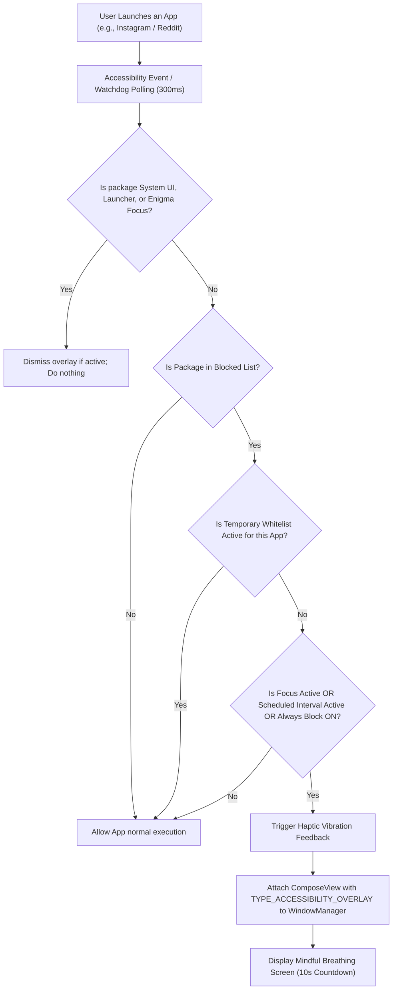
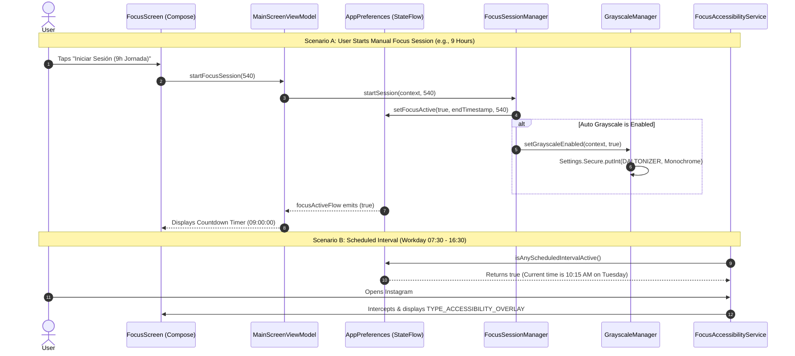
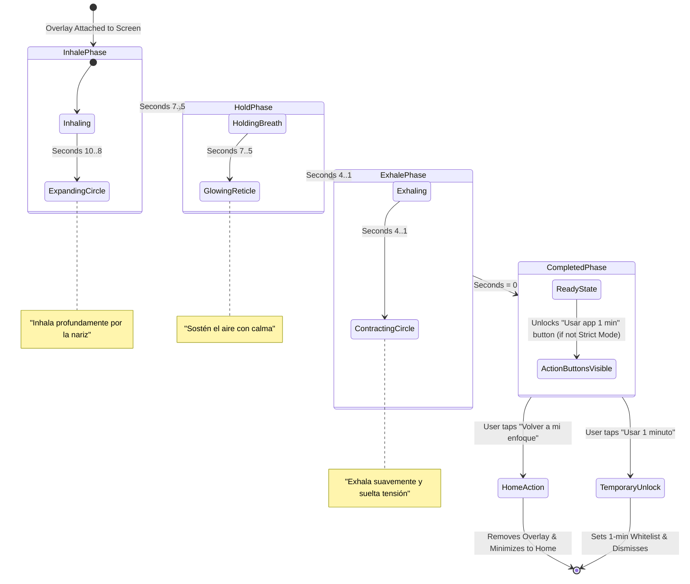
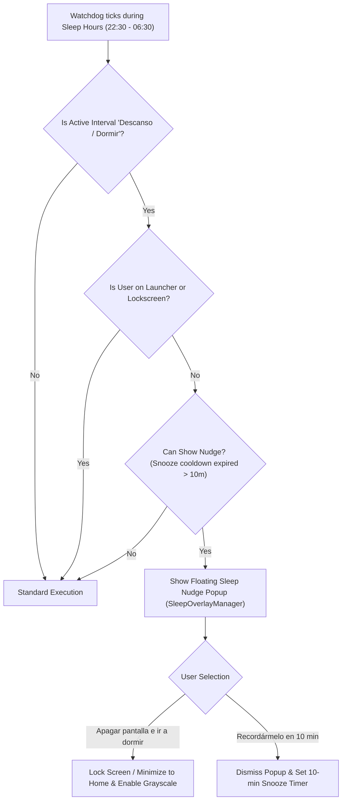
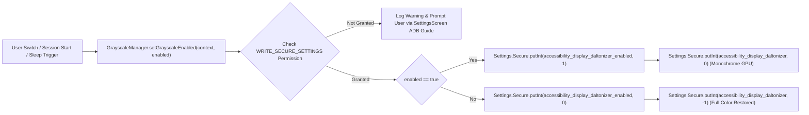

# 📊 Enigma Focus — Flowcharts & Sequence Diagrams

  <strong>Visual Architecture, Lifecycle Sequences, and State Machines (Mermaid)</strong>

---

## 🌐 Table of Contents / Tabla de Contenidos
- [1. App Interception & Blocking Flow](#1-app-interception--blocking-flow)
- [2. Focus Session & Interval Scheduling Lifecycle](#2-focus-session--interval-scheduling-lifecycle)
- [3. Mindful Breathing Overlay State Machine](#3-mindful-breathing-overlay-state-machine)
- [4. Bedtime Sleep Nudge Popup Flow](#4-bedtime-sleep-nudge-popup-flow)
- [5. System Grayscale Hardware Daltonizer State Flow](#5-system-grayscale-hardware-daltonizer-state-flow)

---

## 1. App Interception & Blocking Flow

This flowchart illustrates how `FocusAccessibilityService` detects an app launch, evaluates active schedules and blocklists, and displays the mindful breathing overlay.

---

## 2. Focus Session & Interval Scheduling Lifecycle

Sequence diagram demonstrating the interaction between the User, `MainScreenViewModel`, `AppPreferences`, `FocusSessionManager`, `GrayscaleManager`, and the Background Services.

---

## 3. Mindful Breathing Overlay State Machine

State diagram representing the 10-second mindful breathing exercise phases.

---

## 4. Bedtime Sleep Nudge Popup Flow

Flowchart representing nighttime automatic sleep detection (`22:30 - 06:30`).

---

## 5. System Grayscale Hardware Daltonizer State Flow

