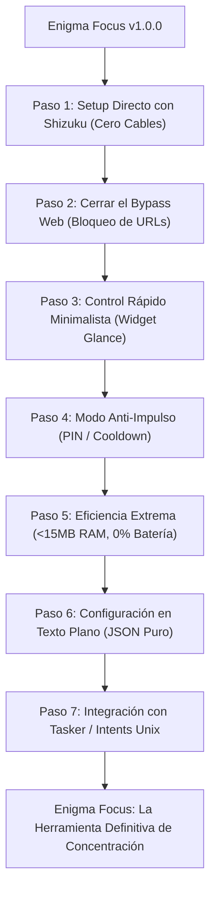

# 🐧 Plan de Mejora en 7 Pasos — Filosofía Unix
## *"Do One Thing and Do It Well" (Haz una sola cosa y hazla excepcionalmente bien)*

---

## 🧘 Manifiesto de Enigma Focus

> *"Las herramientas más poderosas son simples, transparentes, privadas y ligeras. Enigma Focus no busca ser una red social, ni un juego, ni un servicio en la nube. Su único propósito es devolverte el control de tu atención eliminando la dopamina visual y bloqueando las distracciones con cero fricción."*

---

## 🗺️ Los 7 Pasos de Perfeccionamiento Unix

---

## 📋 Índice de Pasos

| Paso | Enfoque Unix | Beneficio Principal | Archivo |
| :--- | :--- | :--- | :--- |
| **Paso 1** | ⚡ **Shizuku / Wireless Debugging** | Activar la escala de grises en 1 toque sin PC ni cables. | [`01_shizuku_setup_sin_cables.md`](01_shizuku_setup_sin_cables.md) |
| **Paso 2** | 🌐 **Cerrar el Bypass Web en Navegadores** | Si bloqueas Instagram, tampoco se abre en Chrome/Brave. | [`02_bloqueo_urls_navegador.md`](02_bloqueo_urls_navegador.md) |
| **Paso 3** | 🎛️ **Widget Minimalista de Pantalla de Inicio** | 1 toque para blanco y negro / ver tu horario sin abrir la app. | [`03_widget_minimalista_glance.md`](03_widget_minimalista_glance.md) |
| **Paso 4** | 🔒 **Modo Anti-Impulso (PIN / Retardo de Desbloqueo)** | Evita sabotear tus propias sesiones en momentos de debilidad. | [`04_modo_anti_impulso_pin.md`](04_modo_anti_impulso_pin.md) |
| **Paso 5** | 🔋 **Consumo Cero (<15MB RAM y 0% Batería)** | Máxima eficiencia con eventos pasivos del kernel de Android. | [`05_optimizacion_extrema_recursos.md`](05_optimizacion_extrema_recursos.md) |
| **Paso 6** | 📄 **Configuración en Texto Plano (JSON)** | Guarda y transfiere tus horarios en un archivo simple y legible. | [`06_configuracion_texto_plano_json.md`](06_configuracion_texto_plano_json.md) |
| **Paso 7** | 🔌 **Control por Intents (Tasker / Scripting)** | Automatiza el bloqueo desde terminal, accesos rápidos o scripts. | [`07_control_por_intents_y_tasker.md`](07_control_por_intents_y_tasker.md) |
