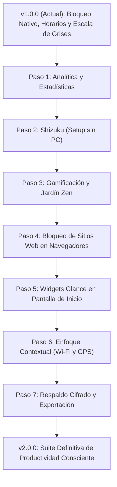

# 🚀 Plan de Mejora en 7 Pasos — Enigma Focus
## *7-Step Improvement Plan & Technical Roadmap*

---

## 📌 Resumen Ejecutivo / Executive Summary
Este plan estratégico detalla la evolución de **Enigma Focus** desde su versión actual (v1.0.0) hasta convertirse en la suite de bienestar digital y concentración más avanzada, privada y respetuosa con el usuario en el ecosistema Android.

Cada paso está diseñado de forma modular, con arquitectura técnica, interfaces sugeridas, dependencias requeridas y criterios de aceptación.

---

## 🗺️ Índice de los 7 Pasos

| Paso | Nombre del Módulo / Feature | Impacto | Complejidad | Documento Detallado |
| :--- | :--- | :---: | :---: | :--- |
| **Paso 1** | 📊 **Analítica de Pantalla y Estadísticas de Enfoque** | Alto | Media | [`01_estadisticas_y_tiempo_pantalla.md`](01_estadisticas_y_tiempo_pantalla.md) |
| **Paso 2** | ⚡ **Integración con Shizuku (Cero PC para ADB)** | Crítico | Media-Baja | [`02_shizuku_setup_sin_pc.md`](02_shizuku_setup_sin_pc.md) |
| **Paso 3** | 🏆 **Gamificación, Rachas y Jardín Zen de Enfoque** | Alto | Media | [`03_gamificacion_y_rachas.md`](03_gamificacion_y_rachas.md) |
| **Paso 4** | 🌐 **Bloqueo de URLs en Navegadores Web** | Alto | Media-Alta | [`04_bloqueo_sitios_web_navegadores.md`](04_bloqueo_sitios_web_navegadores.md) |
| **Paso 5** | 📱 **Widgets Modernos con Jetpack Glance** | Medio | Media-Baja | [`05_widgets_pantalla_inicio_glance.md`](05_widgets_pantalla_inicio_glance.md) |
| **Paso 6** | 📍 **Enfoque por Contexto (Ubicación y Wi-Fi)** | Alto | Media-Alta | [`06_enfoque_por_ubicacion_y_wifi.md`](06_enfoque_por_ubicacion_y_wifi.md) |
| **Paso 7** | 🔒 **Copias de Seguridad Cifradas y Exportación** | Medio | Baja | [`07_backup_cifrado_y_exportacion.md`](07_backup_cifrado_y_exportacion.md) |

---

## 🧭 Diagrama de Ruta de Implementación

